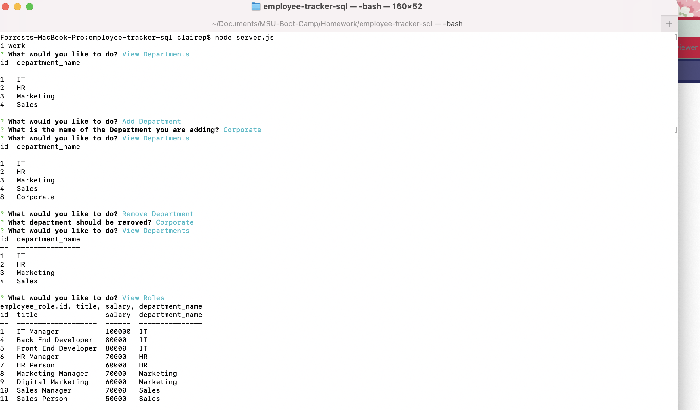
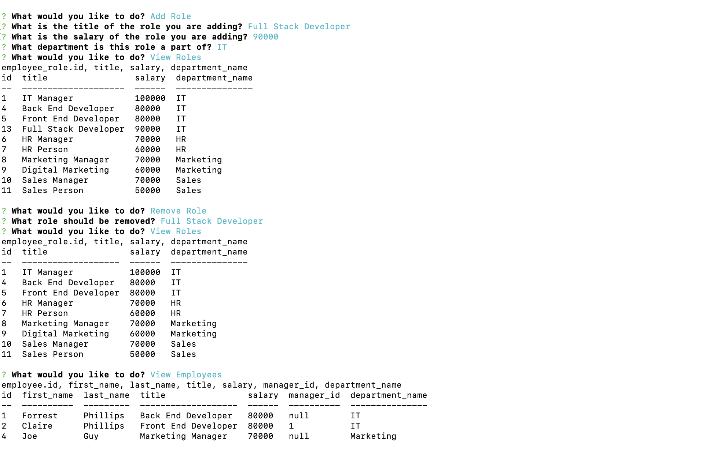
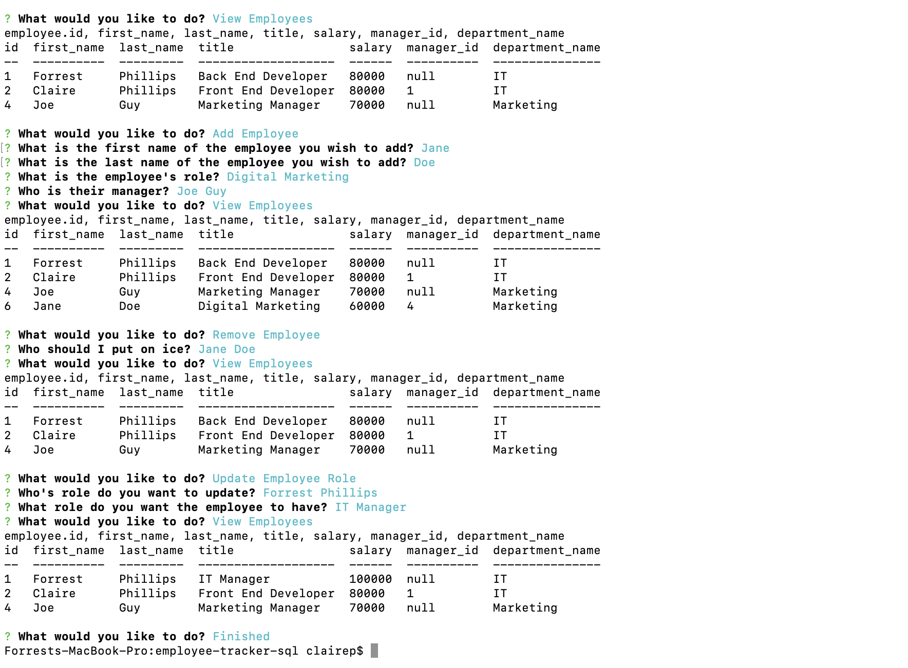
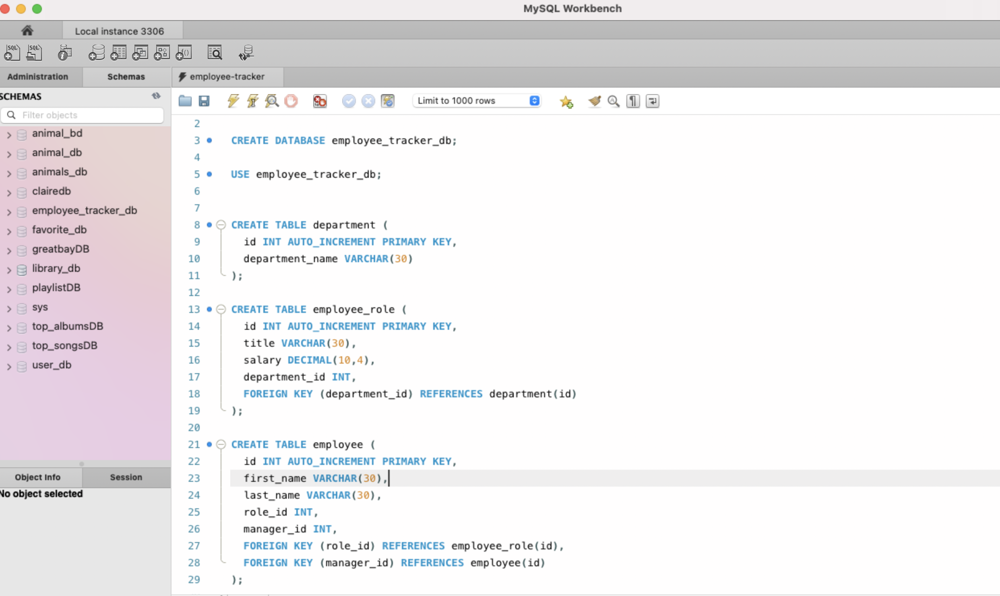
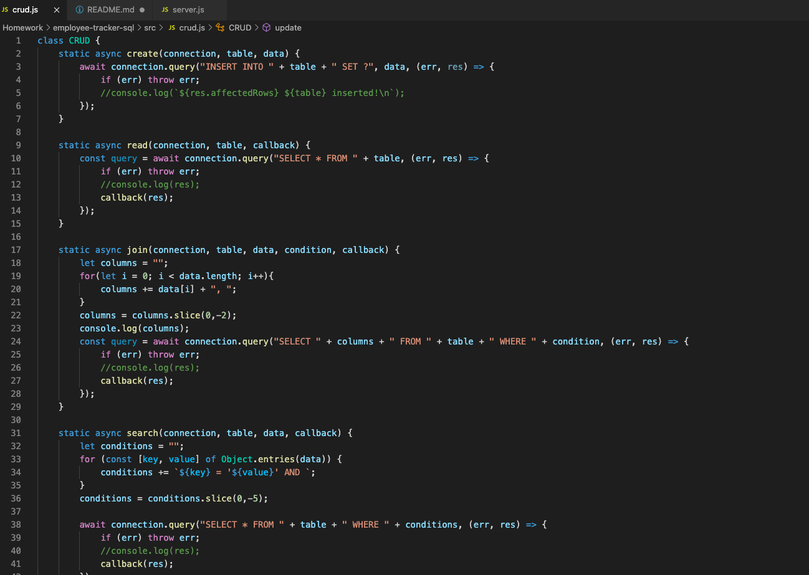
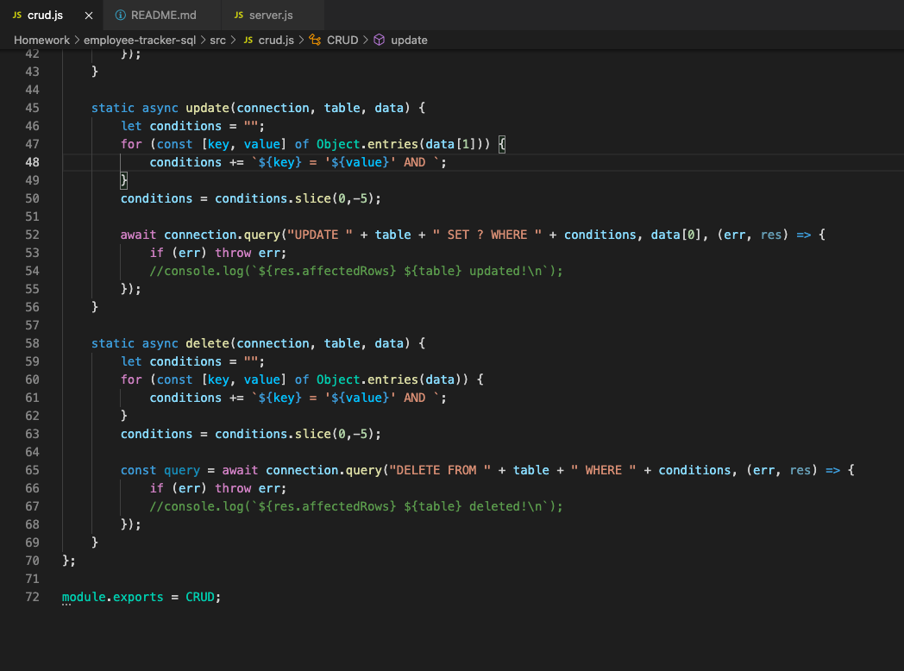
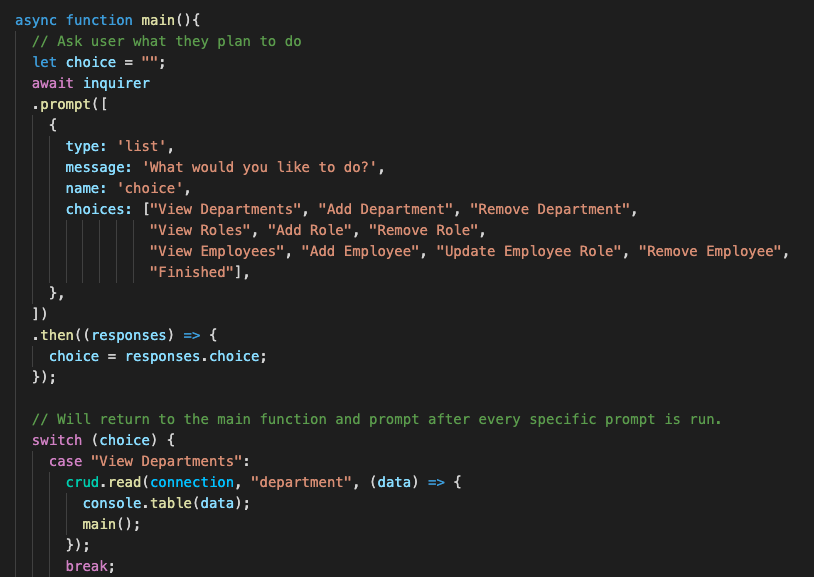

# employee-tracker-sql

## Links
Link to walkthrough video [Video Link](https://drive.google.com/file/d/1d6P9nFZTJyfAEws1y9G8UdExHvlYrN_L/view)
You can also view the video on [Youtube](hhttps://www.youtube.com/watch?v=FHFmDh0qUuc)

What the command line application looks like. 
Part one: 

Part two: 

Part three: 

## Summary
Creating a content managment system to help a company manage it's employees using node, inquirere and MySQL. Only a backend server was built so the application will only run using the command line.  

## Table of Contents
1. [Usage](#usage)
2. [Set Up](#set-up)
3. [What I Learned](#what-i-learned)
4. [Resources](#resources)

## Usage
Using a combination of node, inquirer, and MySQL to create a database that will run various CRUD operations to manage a company's employees and departments. MySQL workbench was used to create the database and three tables that are stored in it. 

The application is run using the command line where inquirier will guide the user through a series of prompts depending on what the user wants to do. Choosing the view prompt will bring up a table displaying the information. 

## Set Up
This application is a fully functioning back end server and database. The server is set up using node, and the database is built using MySQL. Npm console.tables was used to give the displayed data a more readable format in the command line. 

A source folder also holds the crud.js file which is a class that contains all the base/helper functions that were called in the main server file. The create, read, update, delete, and join base functions are used in the server.js file and taliored to the particular inquirer prompt.

The appropraite crud operation is called depending on the prompt. If the user chosses to view a department, role, or employee then the read operation is called and in the case of the "View Role" and "View Employee" the join method is also called.
For adding a role or an employee the create method is used. To update an employee's role the update method is called. Lastly, to delete a department, role, or employee the delete method is called. 

The server.js file holds the main functionality of the command line application and is tied to an asynchronous funtion named main. Within main is the first prompt that displays all the options (i.e. "View Employee", "Update Role', "Add Department", ect.). A switch statment is used to run through the various options and run the appropriate prompt according to what the user choose in the first prompt. After the secondary prompt is completed you are returned to the main prompt again. Once you have the database set up how you want choosing finish will exit the application and end the connection. 

## What I Learned
There were a number of challenges with this application. It felt as though every step was met with an error that had to be fixed before the application would move forward. The table joins gave me the most trouble. In the end I was able to get most of the information from the employee table to match up with the employee role and department tables. The one problem I had was getting the manager's ID to show their name instead of just the id number when calling the view employee table. Any time a "view" is called (i.e "View Employees") is when a join was employed.  

Another challenge that took a lot of time to work through was getting the asynchronous function in the server.js file to work. I ended up having to recall the function "main" after every prompt to get the command line to continue without overriding the ouputted table. 

## Resources
* [npm console.table](https://www.npmjs.com/package/console.table)
* [MySQL Joins](https://www.techonthenet.com/mysql/joins.php#:~:text=MySQL%20JOINS%20are%20used%20to,or%20sometimes%20called%20simple%20join)
* [SQLBolt Multi-table Joins](https://sqlbolt.com/lesson/select_queries_with_joins)
* [npm MySQL](https://www.npmjs.com/package/mysql) 